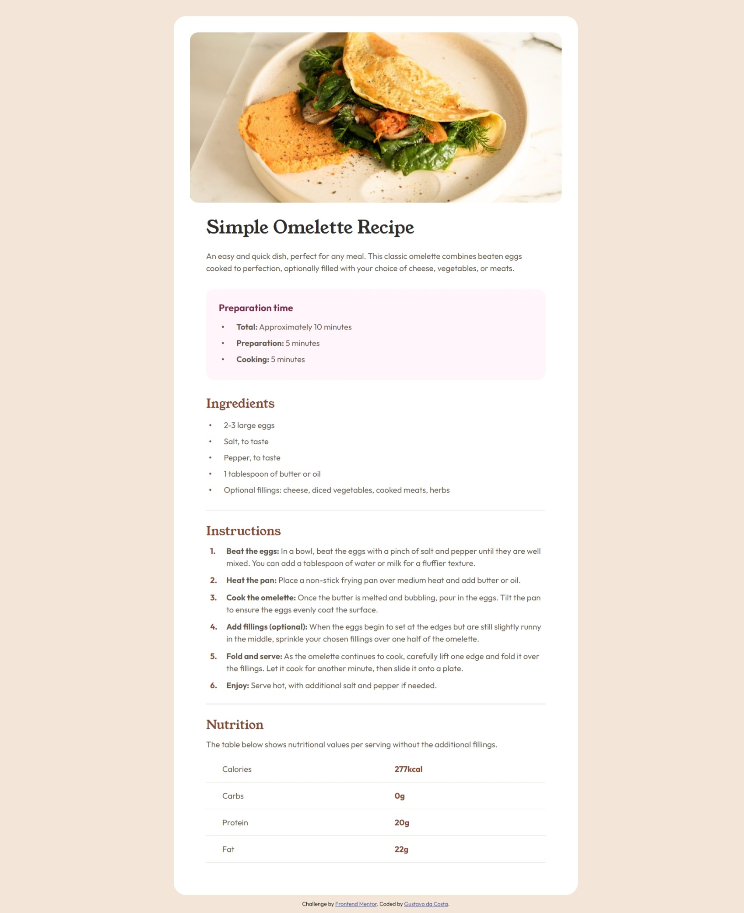
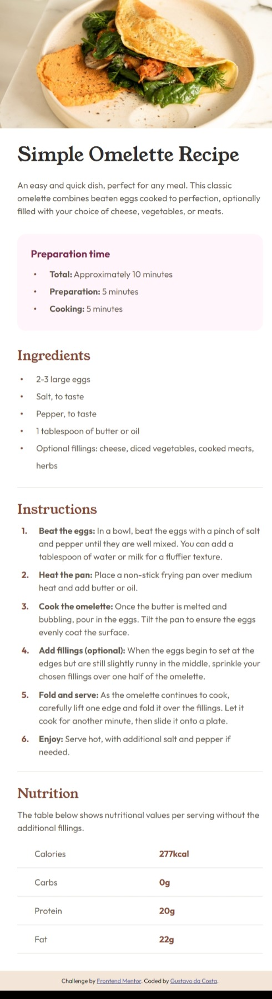

# Frontend Mentor - Recipe page solution - English

This is a solution to the [Recipe page challenge on Frontend Mentor](https://www.frontendmentor.io/challenges/recipe-page-KiTsR8QQKm). Frontend Mentor challenges help you improve your coding skills by building realistic projects. 

## Table of contents

- [Overview](#overview)
  - [Screenshot](#screenshot)
  - [Links](#links)
- [My process](#my-process)
  - [Built with](#built-with)
  - [What I learned](#what-i-learned)
  - [Useful resources](#useful-resources)
- [Author](#author)

## Overview

### Screenshots




### Links

- Solution URL: [Add solution URL here](https://your-solution-url.com)
- Live Site URL: [Add live site URL here](https://your-live-site-url.com)

## My process

### Built with

- Semantic HTML5 markup
- CSS custom properties

### What I learned

Regarding GitHub, I had to watch some tutorials, as I had never created a repository and uploaded a project.

I won't add the semantic html tags that i learned, as there are too many. However, I was able to put them into practice for the first time in this project.

I learned how to deal with responsiveness for other devices, even if in a basic way, but I was able to have that first contact.

```css
@media screen and (max-width: 55rem) {
    main {
        width: 100%;
        border-radius: 0px;
        margin: 0px;
        padding: 0px
    }
    
    main img {
        width: 100%;
        border-radius: 0px;
    }
}
```

I had seen in a tutorial that it was possible to create CSS variables and this made it much easier when using colors in elements.

```css
:root {
    --nutmeg: hsl(14, 45%, 36%);
    --dark-raspberry: hsl(332, 51%, 32%);
    --white: hsl(0, 0%, 100%);
    --rose-white: hsl(330, 100%, 98%);
    --eggshell: hsl(30, 54%, 90%);
    --light-grey: hsl(30, 18%, 87%);
    --wenge-brown: hsl(30, 10%, 34%);
    --dark-charcoal: hsl(24, 5%, 18%);
}
```

I also had to look for solutions to create custom list markers and leave them as required in the challenge design.

```css
ol li {
    position: relative;
    line-height: 1.5rem;
    padding-left: 2.5em; 
    margin-bottom: 10px; 
    counter-increment: list-counter;
}

ol li::before {
    content: counter(list-counter)". "; 
    position: absolute;
    left: 0.5em;
    color: var(--nutmeg); 
    font-weight: bold; 
    margin-right: 10px; 
    font-size: 1em; 
}

ul li {
    margin-left: 35px;
    position: relative;
    line-height: 2em;
    margin-left: em;
}

ul li::before {
    content: '\2022'; 
    color: var(--nutmeg); 
    position: absolute;
    left: -1.5em; 
    font-size: 1.25em;
    line-height: 2rem; 
}
```

The rest I only put into practice what I had already learned in different courses, as I confess that I failed by just watching video classes, producing the video codes and not putting it into practice myself, with personal projects. I was very happy to have developed my first website, even though it was very basic, but it is already progress.

### Useful resources

- [Video 1](https://youtu.be/UziICLiKGpc?si=SH20SS8dDi2v_Etw) - This video helped me a lot at the beginning of the project, as I had no idea how to start styling the page. Watching him, I was able to understand the steps involved in creating a website.
- [Video 2](https://youtu.be/BNcDPK8xPXA?si=fNZg2ZR0cbPK_sMg) - This video helped me use semantic HTML tags, as I was in doubt about which one to use in each situation.
- [Video 3](https://youtu.be/V-_esdbwgbA?si=TsY75sxh2XzZ4Z5e) - Just with this single video I learned how to use media query to add responsiveness to the website. Helped me a lot.
- [Chrome Extension](https://chromewebstore.google.com/detail/mobile-simulator-responsi/ckejmhbmlajgoklhgbapkiccekfoccmk) - Google Chrome extension that simulates the screen of other devices. It helped me when adding responsiveness to the website.
- [Chat GPT](https://chat.openai.com/) - Chat GPT, of course. As always, chat helps us deal with any situation or question.

## Author

- Frontend Mentor - [@GuguP4ulino](https://www.frontendmentor.io/profile/GuguP4ulino)
- Instagram - [@gustavoodacosta_](https://www.instagram.com/gustavoodacosta_/)


# Frontend Mentor - Solução da Página de Receitas - Português

Essa é uma solução para o [Desafio da página de receitas do Frontend Mentor](https://www.frontendmentor.io/challenges/recipe-page-KiTsR8QQKm). Os desafios do Frontend Mentor te ajudam a melhorar suas habilidades de codificação por meio da construção de projetos reais.

## Table of contents

- [Overview](#overview)
  - [Screenshot](#screenshot)
  - [Links](#links)
- [My process](#my-process)
  - [Built with](#built-with)
  - [What I learned](#what-i-learned)
  - [Useful resources](#useful-resources)
- [Author](#author)

## Visão Geral

### Capturas de tela


### Links

- URL da solução: [Add solution URL here](https://your-solution-url.com)

## Meu processo

### Feito com

- Marcação HTML5 semântica
- Propriedades personalizadas de CSS

### O que eu aprendi

Em relação ao GitHub, tive que assistir alguns tutoriais, pois nunca havia criado um repositório e feito upload de um projeto.

Não adicionarei as tags HTML semânticas que aprendi a usar, pois são muitas. Porém, consegui colocá-las em prática pela primeira vez neste projeto.

Aprendi a lidar com a capacidade de resposta para outros dispositivos, mesmo que de forma básica, mas consegui ter esse primeiro contato.

```css
@media screen and (max-width: 55rem) {
    main {
        width: 100%;
        border-radius: 0px;
        margin: 0px;
        padding: 0px
    }
    
    main img {
        width: 100%;
        border-radius: 0px;
    }
}
```

Eu tinha visto em um tutorial que era possível criar variáveis ​​CSS e isso facilitou muito na hora de usar cores nos elementos.

```css
:root {
    --nutmeg: hsl(14, 45%, 36%);
    --dark-raspberry: hsl(332, 51%, 32%);
    --white: hsl(0, 0%, 100%);
    --rose-white: hsl(330, 100%, 98%);
    --eggshell: hsl(30, 54%, 90%);
    --light-grey: hsl(30, 18%, 87%);
    --wenge-brown: hsl(30, 10%, 34%);
    --dark-charcoal: hsl(24, 5%, 18%);
}
```

Também tive que buscar soluções para criar marcadores de lista personalizados e deixar eles conforme exigido no design do desafio.

```css
ol li {
    position: relative;
    line-height: 1.5rem;
    padding-left: 2.5em; 
    margin-bottom: 10px; 
    counter-increment: list-counter;
}

ol li::before {
    content: counter(list-counter)". "; 
    position: absolute;
    left: 0.5em;
    color: var(--nutmeg); 
    font-weight: bold; 
    margin-right: 10px; 
    font-size: 1em; 
}

ul li {
    margin-left: 35px;
    position: relative;
    line-height: 2em;
    margin-left: em;
}

ul li::before {
    content: '\2022'; 
    color: var(--nutmeg); 
    position: absolute;
    left: -1.5em; 
    font-size: 1.25em;
    line-height: 2rem; 
}
```

O resto só coloquei em prática o que já havia aprendido em diversos cursos, pois confesso que falhei em apenas assistir videoaulas, produzir os códigos dos vídeos e não colocar em prática eu mesmo, com projetos pessoais. Fiquei muito feliz por ter desenvolvido meu primeiro site, mesmo sendo bem básico, mas já é um progresso.

### Recursos úteis

- [Video 1](https://youtu.be/UziICLiKGpc?si=SH20SS8dDi2v_Etw) - Esse vídeo me ajudou muito no início do projeto, pois eu não tinha ideia de como começar a estilizar a página. Assitindo ele, pude entender as etapas da criação de um site.
- [Video 2](https://youtu.be/BNcDPK8xPXA?si=fNZg2ZR0cbPK_sMg) - Esse vídeo me ajudou a usar as tags semânticas do HTML, pois fiquei em dúvida sobre qual usar em cada situação.
- [Video 3](https://youtu.be/V-_esdbwgbA?si=TsY75sxh2XzZ4Z5e) - Apenas com este único vídeo aprendi como usar media query para adicionar responsividade ao site. Me ajudou muito.
- [Extensão do Chrome](https://chromewebstore.google.com/detail/mobile-simulator-responsi/ckejmhbmlajgoklhgbapkiccekfoccmk) - Extensão do Google Chrome que simula a tela de outros dispositivos. Isso me ajudou a adicionar responsividade ao site.
- [Chat GPT](https://chat.openai.com/) - Chat GPT, é claro. Como sempre, o chat nos ajuda a lidar com qualquer situação ou dúvida.

## Autor

- Frontend Mentor - [@GuguP4ulino](https://www.frontendmentor.io/profile/GuguP4ulino)
- Instagram - [@gustavoodacosta_](https://www.instagram.com/gustavoodacosta_/)
